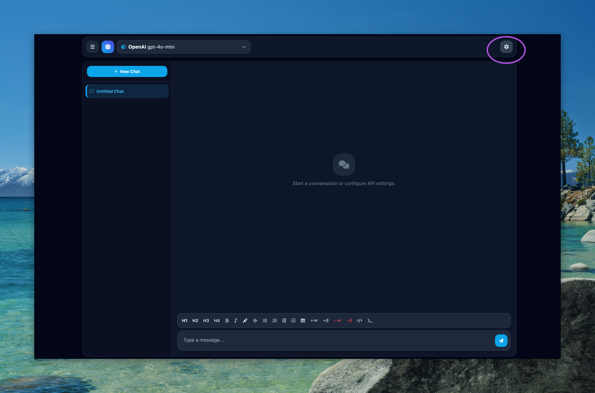
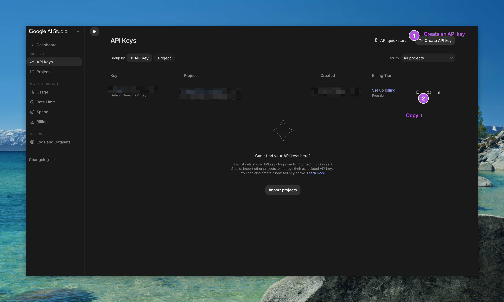
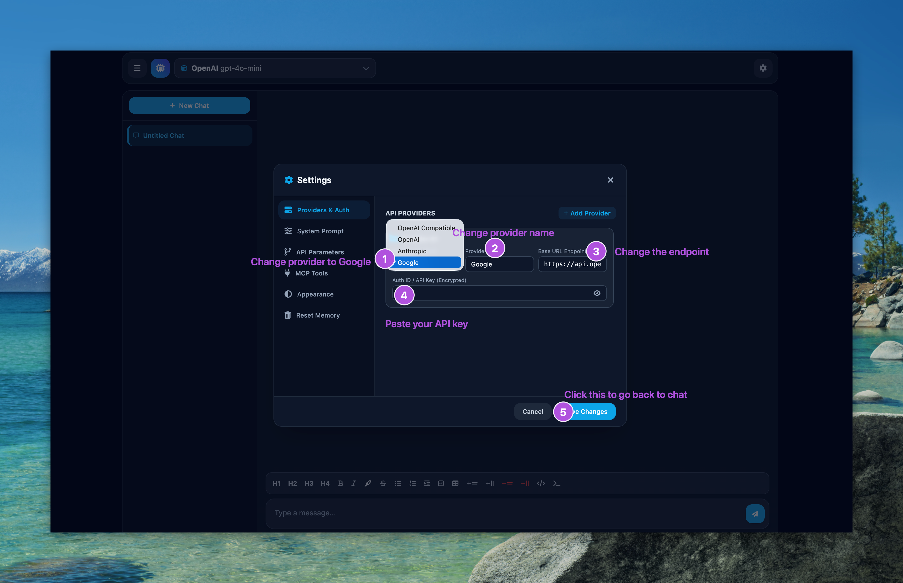

# Docs for AI harness
[AI Harness](https://mrcheesie.github.io/alris_games/AI-harness/)

## Setting up an API key:
*This next section will guide you through setting up the AI harness with google's API.*

1. Go to settings (Gear icon on the top right of the screen)


2. Then Change the provider to Google and change the endpoint to
```API-URL
https://generativelanguage.googleapis.com/v1beta/openai/
```

3. Navigate to [Google AI Studio](https://aistudio.google.com/api-keys) and get your free API key from there.

4. Paste the API key into the AI harness.

5. Close settings
6. Select a model from the model picker in the top left corner (the Flash models are free)
7. Enjoy your chat
